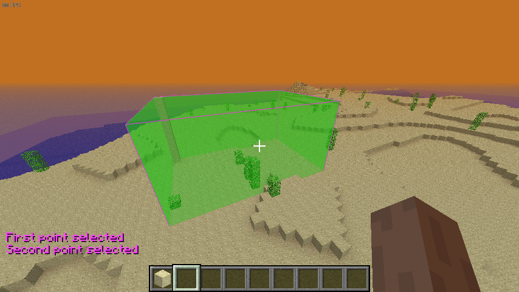

# Client

Этот модуль содержит функции, необходимые для управления клиентами (реальными, либо виртуальными, ботами). Для подключения его функций используйте директиву `#include <client.h>`.

## Доступные функции

!!! warning
	Функции в этом разделе, помеченные звёздочкой (*), не будут отсылать никаких пакетов ванильным клиентам, не поддерживающим расширение классического протокола (CPE).

### Client_NewBot

Создаёт новый объект `Client` и возвращает на него указатель. Управление ботами производится средствами этого модуля.

```c++
Client *Client_NewBot(void);
```

### Client_IsBot

Проверяет, является ли переданный клиент ботом.

```c++
cs_bool Client_IsBot(Client *client);
```

### Client_Lock

Блокирует структуру клиента при многопоточном взаимодействии.

```c++
void Client_Lock(Client *client);
```

### Client_Unlock

Разблокирует структуру клиента.

```c++
void Client_Unlock(Client *client);
```

### Client_ChangeWorld

Переносит клиента в указанный мир.

```c++
cs_bool Client_ChangeWorld(Client *client, World *world);
```

### Client_Chat

Отправляет игроку сообщение указанного [типа](../Types.md#emesgtype).

!!! note
	Типы сообщений определяются расширением классического протокола (CPE), если игрок использует клиент без CPE, то сообщение при любом параметре `type` будет показано **в чате**!

```c++
void Client_Chat(Client *client, EMesgType type, cs_str message);
```

### Client_Kick

Кикает указанного клиента.

!!! note
	Если клиент является ботом, то после вызова этой функции он будет удалён, с этого момента обращаться к объекту более нет возможности.

```c++
void Client_Kick(Client *client, cs_str reason)
```

### Client_KickFormat

Кикает указанного клиента, отправляя ему отформатированное сообщение.

```c++
void Client_KickFormat(Client *client, cs_str format, ...);
```

### Client_UpdateWorldInfo *

Отправляет игроку CPE пакет обновления окружения (погода, цвета, текстурпак и другие параметры)

!!! warning
	Не рекомендуется использовать данную функцию вручную, работу можно предоставить [этой функции](World.md#world_finishenvupdate), она автоматически отправит пакет всем клиентам, которые находятся в указанном мире.

```c++
void Client_UpdateInfo(Client *client, World *world, cs_bool updateAll);
```

### Client_Update *

Отправляет всем клиентам, находящимся в одном мире с указанным клиентом, CPE пакеты для обновления некоторых параметров его сущности (модель, отображаемый ник, вращение модели).

```c++
void Client_Update(Client *client);
```

### Client_SendHacks *

Отправляет изменения [чит-параметров](../Types.md#cpehacks) указанному игроку.

```c++
cs_bool Client_SendHacks(Client *client, CPEHacks *hacks);
```

### Client_NewSelection

Данная функция создаёт область выделения для указанного клиента. Функции для изменения параметров выделенной области описаны [здесь](CPE.md).

!!! warning
	Если клиент не поддерживает CPE дополнение SelectionCuboid, функция вернёт NULL!

```c++
CPECuboid *Client_NewSelection(Client *client);
```

### Client_UpdateSelection *

Отправляет игроку параметры для создания выделенной области.

```c++
cs_bool Client_UpdateSelection(Client *client, CPECuboid *cub);
```



### Client_RemoveSelection *

Удаляет выделение с области.

!!! warning
	Использование объекта `CPECuboid` после вызова этой функции невозможно!

```c++
cs_bool Client_RemoveSelection(Client *client, CPECuboid *cub);
```

### Client_TeleportTo

Телепортирует указанного клиента на точку `vec` с направлением взгляда `ang`.

```c++
cs_bool Client_TeleportTo(Client *client, Vec *pos, Ang *ang);
```

### Client_TeleportToSpawn

Телепортирует клиента на точку спавна того мира, в котором он находится в данный момент.

```c++
cs_bool Client_TeleportToSpawn(Client *client);
```

### Client_CheckState

Проверяет, находится ли клиент в [указанном состоянии](../Types.md#eclientstate).

```c++
cs_bool Client_CheckState(Client *client, EClientState state);
```

### Client_IsClosed

Проверяет, было ли закрыто соединение с указанным клиентом.

!!! note
	Если соединение с клиентом было закрыто, сервер перестанет пытаться отправить ему какие-либо пакеты и в скором времени удалит его объект из памяти, так что использование этого объекта в таком случае должно прекратиться!

```c++
cs_bool Client_IsClosed(Client *client);
```

### Client_IsLocal

Проверяет, находится ли указанный клиент в локальной сети вместе с сервером.

```c++
cs_bool Client_IsLocal(Client *client);
```

### Client_IsInSameWorld

Проверяет, находятся ли указанные клиенты в одном мире.

```c++
cs_bool Client_IsInSameWorld(Client *client, Client *other);
```

### Client_IsInWorld

Проверяет, находятся ли клиент в указанном мире.

```c++
cs_bool Client_IsInWorld(Client *client, World *world);
```

### Client_IsOP


```c++
cs_bool Client_IsOP(Client *client);
```

### Client_IsSpawned


```c++
cs_bool Client_IsSpawned(Client *client);
```

### Client_IsFirstSpawn


```c++
cs_bool Client_IsFirstSpawn(Client *client);
```


### Client_SetDisplayName


```c++
cs_bool Client_SetDisplayName(Client *client, cs_str name);
```

### Client_SetWeather


```c++
cs_bool Client_SetWeather(Client *client, cs_int8 type);
```

### Client_SetInvOrder


```c++
cs_bool Client_SetInvOrder(Client *client, cs_byte order, BlockID block);
```

### Client_SetServerIdent


```c++
cs_bool Client_SetServerIdent(Client *client, cs_str name, cs_str motd);
```

### Client_SetEnvProperty


```c++
cs_bool Client_SetEnvProperty(Client *client, EProp property, cs_int32 value);
```

### Client_SetEnvColor


```c++
cs_bool Client_SetEnvColor(Client *client, EColor type, Color3* color);
```

### Client_SetTexturePack


```c++
cs_bool Client_SetTexturePack(Client *client, cs_str url);
```

### Client_AddTextColor


```c++
cs_bool Client_AddTextColor(Client *client, Color4* color, cs_char code);
```

### Client_SetBlock


```c++
void Client_SetBlock(Client *client, SVec *pos, BlockID id);
```

### Client_SetModel


```c++
cs_bool Client_SetModel(Client *client, cs_int16 model);
```

### Client_SetModelStr


```c++
cs_bool Client_SetModelStr(Client *client, cs_str model);
```

### Client_SetBlockPerm


```c++
cs_bool Client_SetBlockPerm(Client *client, BlockID block, cs_bool allowPlace, cs_bool allowDestroy);
```

### Client_SetHeldBlock


```c++
cs_bool Client_SetHeldBlock(Client *client, BlockID block, cs_bool preventChange);
```

### Client_SetClickDistance


```c++
cs_bool Client_SetClickDistance(Client *client, cs_uint16 dist);
```

### Client_SetHotkey


```c++
cs_bool Client_SetHotkey(Client *client, cs_str action, ELWJGLKey keycode, ELWJGLMod keymod);
```

### Client_SetHotbar


```c++
cs_bool Client_SetHotbar(Client *client, cs_byte pos, BlockID block);
```

### Client_SetSkin


```c++
cs_bool Client_SetSkin(Client *client, cs_str skin);
```

### Client_SetSpawn


```c++
cs_bool Client_SetSpawn(Client *client, Vec *pos, Ang *ang);
```

### Client_SetOP


```c++
cs_bool Client_SetOP(Client *client, cs_bool state);
```

### Client_SetVelocity


```c++
cs_bool Client_SetVelocity(Client *client, Vec *velocity, cs_byte mode);
```

### Client_SetProp


```c++
cs_bool Client_SetProp(Client *client, EEntProp prop, cs_int32 value);
```

### Client_SetGroup


```c++
cs_bool Client_SetGroup(Client *client, cs_uintptr gid);
```

### Client_SpawnParticle


```c++
cs_bool Client_SpawnParticle(Client *client, cs_byte id, Vec *pos, Vec *origin);
```

### Client_SendPluginMessage


```c++
cs_bool Client_SendPluginMessage(Client *client, cs_byte channel, cs_str message);
```

### Client_UndefineModel


```c++
cs_bool Client_UndefineModel(Client *client, cs_byte id);
```

### Client_ExtTeleportTo


```c++
cs_bool Client_ExtTeleportTo(Client *client, cs_byte behavior, Vec *pos, Ang *ang);
```


### Client_GetState


```c++
EClientState Client_GetState(Client *client);
```

### Client_GetName


```c++
cs_str Client_GetName(Client *client);
```

### Client_GetDisplayName


```c++
cs_str Client_GetDisplayName(Client *client);
```

### Client_GetAppName


```c++
cs_str Client_GetAppName(Client *client);
```

### Client_GetKey


```c++
cs_str Client_GetKey(Client *client);
```

### Client_GetSkin


```c++
cs_str Client_GetSkin(Client *client);
```

### Client_GetDisconnectReason


```c++
cs_str Client_GetDisconnectReason(Client *client);
```

### Client_GetID


```c++
ClientID Client_GetID(Client *client);
```

### Client_GetByID


```c++
Client *Client_GetByID(ClientID id);
```

### Client_GetByName


```c++
Client *Client_GetByName(cs_str name);
```

### Client_GetWorld


```c++
World *Client_GetWorld(Client *client);
```

### Client_GetStandBlock


```c++
BlockID Client_GetStandBlock(Client *client);
```

### Client_GetFluidLevel


```c++
cs_int8 Client_GetFluidLevel(Client *client, BlockID *fluid);
```

### Client_GetModel


```c++
cs_int16 Client_GetModel(Client *client);
```

### Client_GetHeldBlock


```c++
BlockID Client_GetHeldBlock(Client *client);
```

### Client_GetClickDistance


```c++
cs_uint16 Client_GetClickDistance(Client *client);
```

### Client_GetClickDistanceInBlocks


```c++
cs_float Client_GetClickDistanceInBlocks(Client *client);
```

### Client_GetPosition


```c++
void Client_GetPosition(Client *client, Vec *pos, Ang *ang);
```

### Client_GetExtVer


```c++
cs_int32 Client_GetExtVer(Client *client, cs_ulong exthash);
```

### Client_GetAddr


```c++
cs_uint32 Client_GetAddr(Client *client);
```

### Client_GetPing


```c++
cs_int32 Client_GetPing(Client *client);
```

### Client_GetAvgPing


```c++
cs_float Client_GetAvgPing(Client *client);
```

### Client_GetGroup


```c++
CGroup *Client_GetGroup(Client *client);
```

### Client_GetGroupID


```c++
cs_uintptr Client_GetGroupID(Client *client);
```


### Client_Spawn


```c++
cs_bool Client_Spawn(Client *client);
```

### Client_Despawn


```c++
cs_bool Client_Despawn(Client *client);
```
